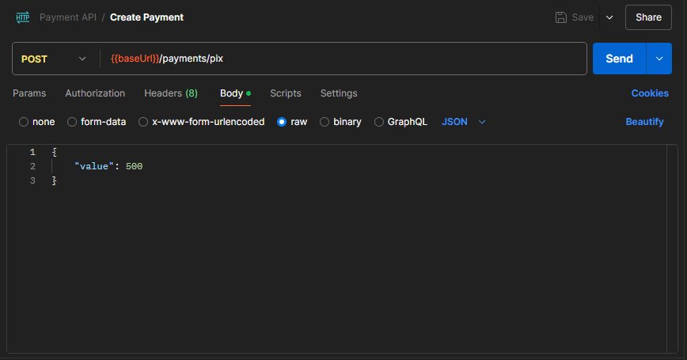
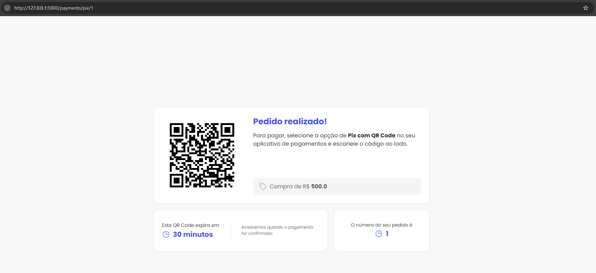
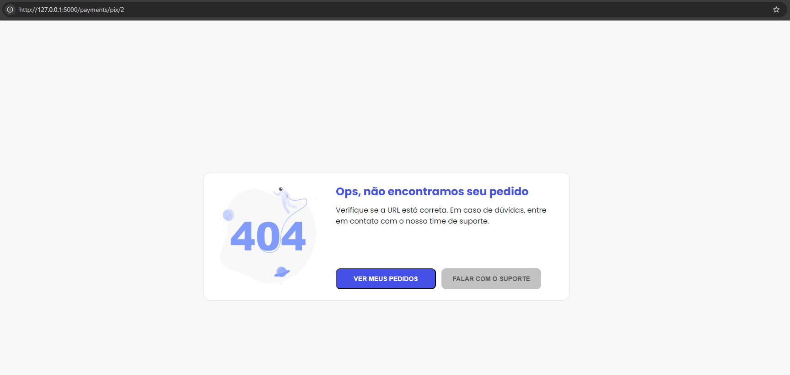
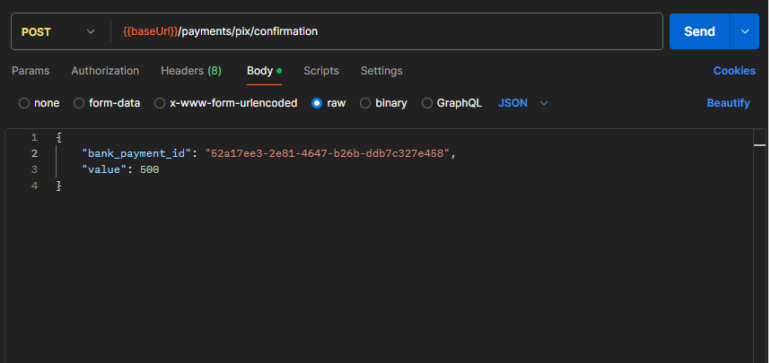
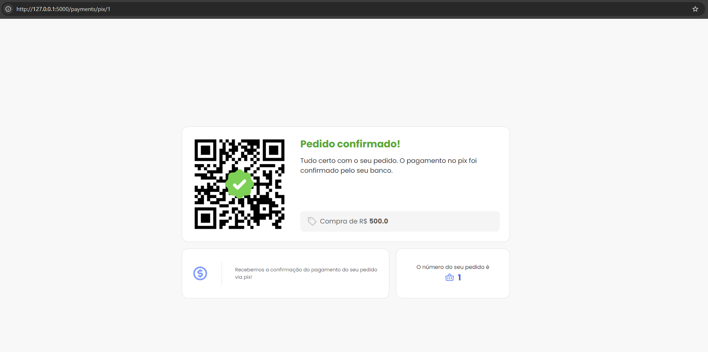

# Real Time Comunication Flask

Este repositório contém uma aplicação que utiliza notificações em tempo real com o protocolo WebSockets `Flask-SocketIO`, com o objetivo de realizar a hipotética confirmação de um pagamento em tempo real.

### Tecnologias Utilizadas
* **Python:** Principal, utilizada para desenvolver a lógica da aplicação.
* **Flask:** Framework web, Criar a API e gerenciar as rotas da aplicação.
* **Postman:** Ferramenta utilizada para testar e validar as requisições HTTP.
* **Docker:** Ferramenta de conteinerização.
* **Git:** Controle de versão.

### Instalação
Considerando que você já tenha o Python, Docker e Postman instalados em seu sistema, execute os passos para a execução do app.

1. Clone o repositório para sua máquina local:
```bach
https://github.com/narcelllo/Real-time-comunication-Flask.git
```

2. Navegue até o diretório do projeto e execute:
```
pip install -r requirements.txt
```
Todas as dependências serão instaladas com base no arquivo `requirements.txt` existente neste repositório

## Docker
1. Em `docker-compose.yml` adicione seu diretório MySQL para consistir seus dados:
 
  

2. Execute o comando:
```
docker-compose up
```
## Criando banco de dados
1. Em seu terminal acesse o flask shell: 

```
flask shell
```
```
db.create_all()
```
```
db.session.commit()
```
```
exit()
```
## Postman:
  1. Importe a pasta `Payment` e selecione as opções de colections e environments de acordo com o exemplo:
  

## Execução
1. Execute o comando abaixo em seu terminal.
```
python app.py
```
Isso executa seu server e permitindo a execução da API

2. Crie um pagamento via postman.

3. Em seu navegador  acesse a URL:
```
http://127.0.0.1:5000/payments/pix/"id do Payment desejado"
```
Você deve visualizar a pagina: 

Caso o pagamento não exista, a pagina abaixo será apresentada:


4. Para confirmar o pagamento você precisa copiar a `"bank_payment_id":` criado como resposta em seu Postman e colar na rota `{{baseUrl}}/payments/pix/confirmation`:



A pagina abaixo deverá aparecer confirmando o "pagamento":


## Executando testes
1. Certifique-se que seu server está em execução.
2. No terminal, navegue até a pasta `tests`
3. execute o comando:
```
pytest test_pix.py -v 
```


## OBS
Desenvolvido baseado na formação Python Rocketseat modulo: Comunicação em tempo real com Flask